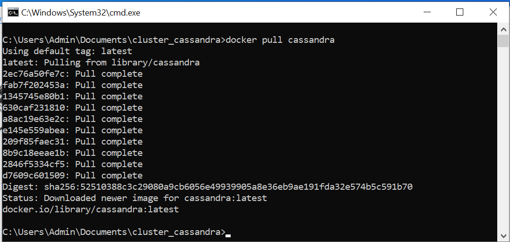
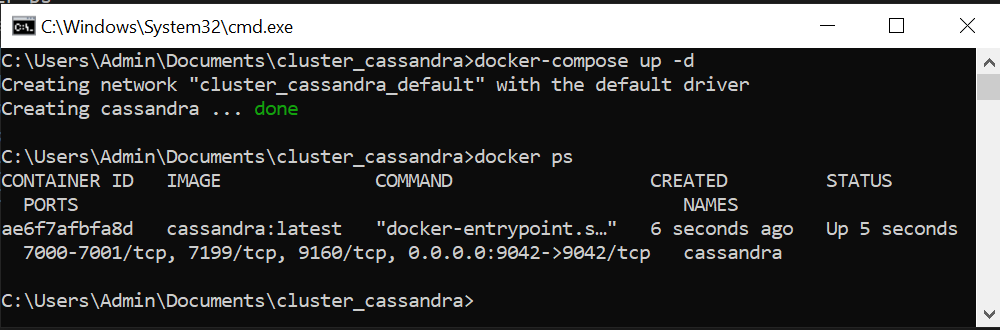
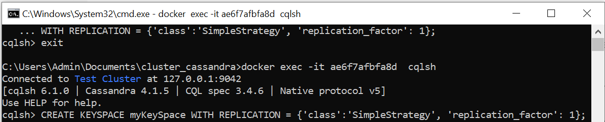
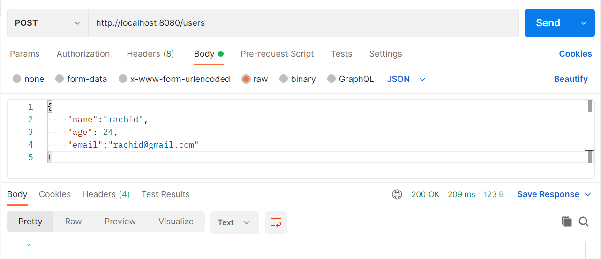
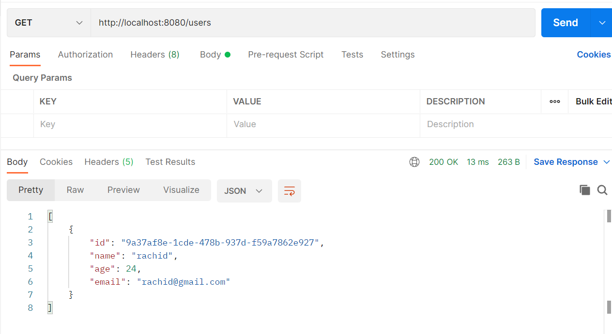

<h1>Documentation</h1>
<ul>
    <li>Installation de cassandra</li>
     
    
     
    <li>exécution de cassandra</li>
     
    
     
    <li>Creation de key space</li>
     
    
</ul>
<h1>Test</h1>
<ul>
    <li>Ceation d'un utilisateur</li>
     
    
     
    <li>Affichage des utilisateurs</li>
     
    
</ul>
